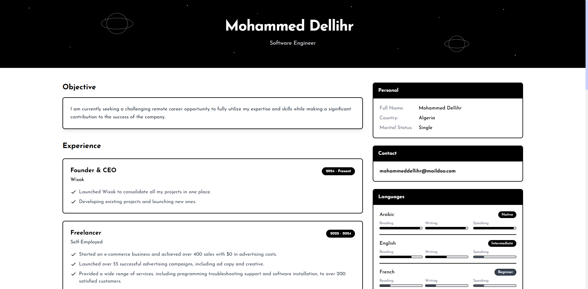

# Mohammed Dellihr - Professional CV Website

A modern, responsive CV/resume website for Mohammed Dellihr built with Tailwind CSS. This project showcases professional experience, skills, and contact information in a clean, user-friendly interface.

## Features

- **Modern Design**: Built with Tailwind CSS for a clean, modern look
- **Fully Responsive**: Optimized for all device sizes from mobile to desktop
- **Multilingual Support**: Available in 10 languages
- **Interactive Elements**: Smooth animations and transitions
- **Accessibility**: Designed with accessibility in mind
- **Print-Friendly**: Optimized for printing

## Technologies Used

- **HTML5**: Semantic markup
- **Tailwind CSS**: Utility-first CSS framework
- **Alpine.js**: Lightweight JavaScript framework for interactivity
- **Responsive Design**: Mobile-first approach
- **Custom Animations**: Subtle animations for enhanced user experience

## Development

This project uses Tailwind CSS via CDN for simplicity. No build process is required to make changes.

## License

All rights reserved. © Mohammed Dellihr

## Contact

For inquiries, please contact: mohammeddellihr@maildoo.com